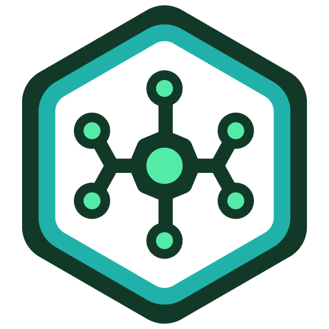
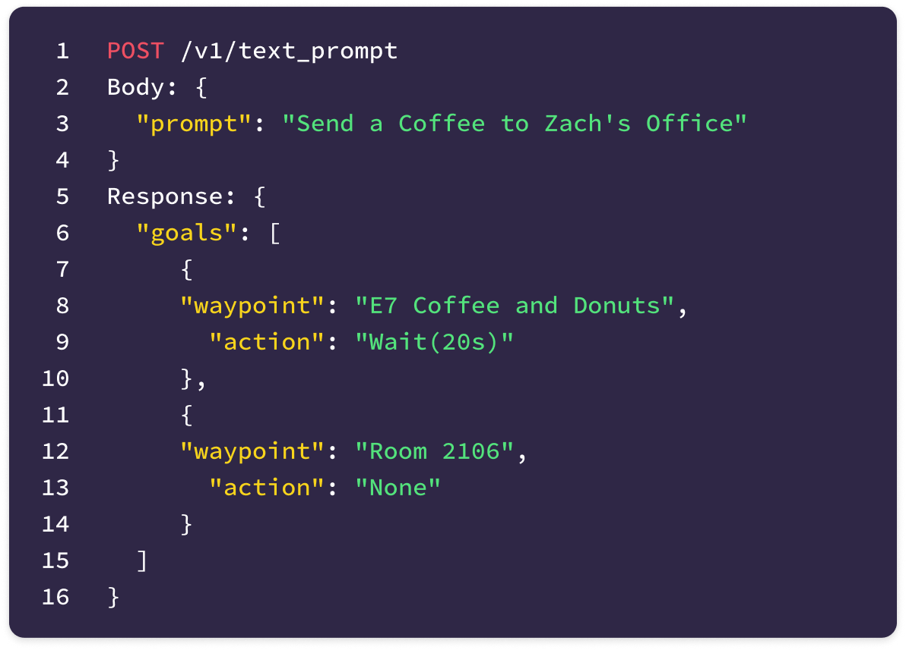

<a id="readme-top"></a>
<br />
<div align="center">

  <a href="https://github.com/ammar-s847/fydp-repo"></a>

  <h3 align="center">Axon - ML Platform</h3>

  <p align="center">
    ML platform for training, versioning, and experimenting with VLA models at scale
    <br />
    <a href="https://github.com/ammar-s847/fydp-repo"><strong>Explore the docs »</strong></a>
    <br />
  </p>
</div>


<!-- TABLE OF CONTENTS -->
<!-- <details>
  <summary>Table of Contents</summary>
  <ol>
    <li>
      <a href="#about-the-project">About The Project</a>
      <ul>
        <li><a href="#built-with">Built With</a></li>
      </ul>
    </li>
    <li>
      <a href="#getting-started">Getting Started</a>
      <ul>
        <li><a href="#prerequisites">Prerequisites</a></li>
        <li><a href="#installation">Installation</a></li>
      </ul>
    </li>
    <li><a href="#usage">Usage</a></li>
    <li><a href="#roadmap">Roadmap</a></li>
    <li><a href="#contributing">Contributing</a></li>
    <li><a href="#license">License</a></li>
    <li><a href="#contact">Contact</a></li>
    <li><a href="#acknowledgments">Acknowledgments</a></li>
  </ol>
</details> -->


<!-- ABOUT THE PROJECT -->
## About The Project

API Example

<div align="center">

</div>
<!--  -->

<p align="right">(<a href="#readme-top">back to top</a>)</p>


### Built With


</img> </img> </img></img> </img> </img> </img>  </img>

<p align="right">(<a href="#readme-top">back to top</a>)</p>


## Getting Started


### Prerequisites

Get API Keys for

`.env` file:
```sh
ANTHROPIC_API_KEY=""
OPENAI_API_KEY=""
HF_ACCESS_TOKEN=""
COHERE_API_KEY=""
WANDB_API_KEY="" # Weights and Biases
```

### Installation

1. Install dependencies
```sh
poetry install
```

### API and Swagger Docs

1. Run the API

```sh
cd platform
fastapi dev main.py
```

2. Visit http://localhost:8000/docs

<p align="right">(<a href="#readme-top">back to top</a>)</p>

## Roadmap

- [] Build Inference Pods
- [] Setup K8S Infra

<p align="right">(<a href="#readme-top">back to top</a>)</p>
